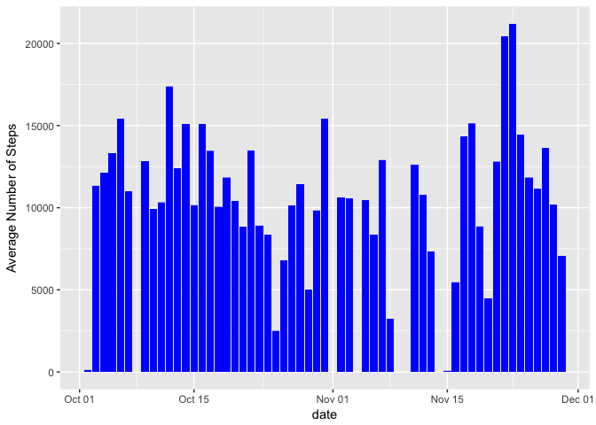
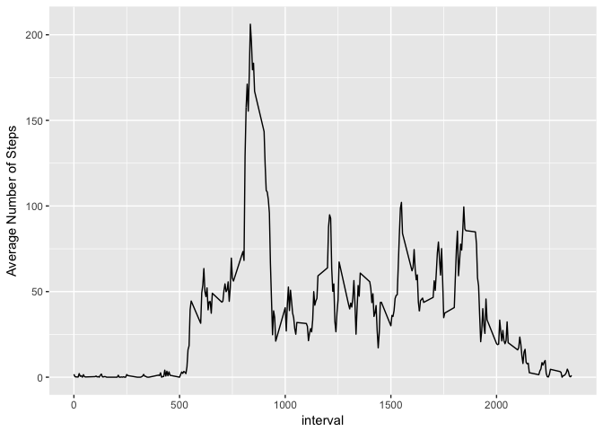
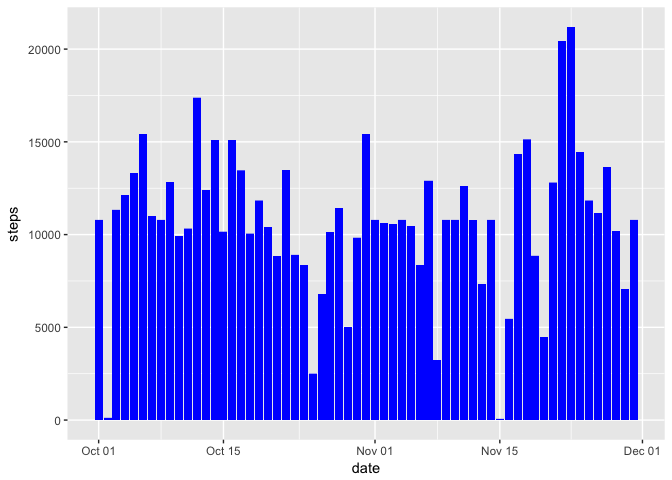
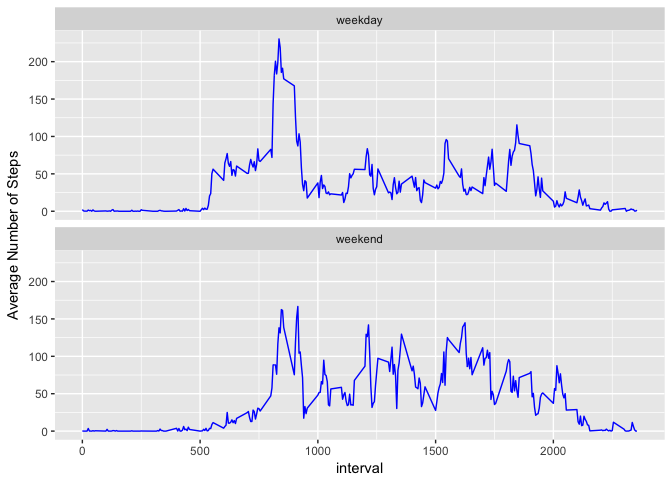

## Loading and preprocessing the data

```r
library(ggplot2)
library(dplyr)
activity <- read.csv("activity.csv")
activity$date <- as.Date(activity$date, "%Y-%m-%d")
```

## What is mean total number of steps taken per day?

```r
activity %>% 
      group_by(date) %>% 
      summarise(avg_steps = mean(steps, na.rm = T), 
                median_steps = median(steps, na.rm = T)) %>% 
      ungroup()
```

```
## # A tibble: 61 x 3
##    date       avg_steps median_steps
##    <date>         <dbl>        <dbl>
##  1 2012-10-01   NaN              NA 
##  2 2012-10-02     0.438           0.
##  3 2012-10-03    39.4             0.
##  4 2012-10-04    42.1             0.
##  5 2012-10-05    46.2             0.
##  6 2012-10-06    53.5             0.
##  7 2012-10-07    38.2             0.
##  8 2012-10-08   NaN              NA 
##  9 2012-10-09    44.5             0.
## 10 2012-10-10    34.4             0.
## # ... with 51 more rows
```


```r
ggplot(data = activity) +
      geom_histogram(mapping = aes(x = date, y = steps), stat = "identity", fill = "blue") + 
      ylab("Average Number of Steps")
```

<!-- -->

## What is the average daily activity pattern?

```r
activity %>% 
      group_by(interval) %>% 
      summarise(avg_steps = mean(steps, na.rm = T)) %>% 
      ungroup() %>% 
      ggplot() +
      geom_line(aes(x=interval, y = avg_steps)) +
      ylab("Average Number of Steps")
```

<!-- -->

```r
maximum <- which.max(tapply(activity$steps, activity$interval, mean, na.rm = T))
```
We can see from this plot that the 5-minute interval that contains the max number of steps in the dataset is the interval 835.

## Imputing missing values


```r
sum(is.na(activity))
```

```
## [1] 2304
```


```r
activity %>% 
      group_by(date) %>% 
      summarise(blank_ints = sum(is.na(steps))) %>% 
      filter(blank_ints > 0) %>% 
      ungroup()
```

```
## # A tibble: 8 x 2
##   date       blank_ints
##   <date>          <int>
## 1 2012-10-01        288
## 2 2012-10-08        288
## 3 2012-11-01        288
## 4 2012-11-04        288
## 5 2012-11-09        288
## 6 2012-11-10        288
## 7 2012-11-14        288
## 8 2012-11-30        288
```


```r
interval_summary <- activity %>% 
      group_by(interval) %>% 
      summarise(avg_int = mean(steps, na.rm = T),
                max_int = max(steps, na.rm = T)) %>% 
      ungroup()
impute_values <- rep(interval_summary$avg_int,8)
activity[is.na(activity$steps), "steps"] <- impute_values
```


```r
ggplot(data = activity) +
      geom_histogram(mapping = aes(x = date, y = steps), stat = "identity", 
                     fill = "blue")
```

<!-- -->

```r
activity %>% 
      group_by(date) %>% 
      summarise(avg_steps = mean(steps, na.rm = T),
                med_steps = median(steps, na.rm = T)) %>% 
      ungroup()
```

```
## # A tibble: 61 x 3
##    date       avg_steps med_steps
##    <date>         <dbl>     <dbl>
##  1 2012-10-01    37.4        34.1
##  2 2012-10-02     0.438       0. 
##  3 2012-10-03    39.4         0. 
##  4 2012-10-04    42.1         0. 
##  5 2012-10-05    46.2         0. 
##  6 2012-10-06    53.5         0. 
##  7 2012-10-07    38.2         0. 
##  8 2012-10-08    37.4        34.1
##  9 2012-10-09    44.5         0. 
## 10 2012-10-10    34.4         0. 
## # ... with 51 more rows
```
## Are there differences in activity patterns between weekdays and weekends?


```r
activity$day <- "weekday"
activity[weekdays(activity$date) %in% c("Saturday","Sunday"), "day"] <- "weekend"
```


```r
activity %>% 
      group_by(interval, day) %>% 
      summarise(avg_steps = mean(steps, na.rm = T)) %>% 
      ungroup() %>% 
      ggplot() +
      geom_line(mapping = aes(x = interval, y = avg_steps), color = "blue") + 
      facet_wrap(~ day, nrow = 2) +
      ylab("Average Number of Steps")
```

<!-- -->
